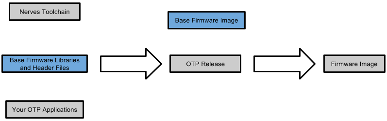

# Nerves System BR

## IMPORTANT: Configuring builds has changed since the 0.3.3 release. Please reread this document.

Nerves is a collection of projects for building Elixir and Erlang-based software for embedded devices.
This project is responsible for the core C/C++ libraries, Linux kernel, and base
root filesystem as highlighted in the following diagram:

For most development with Nerves, you may not even need to build this.
Tools such as [bake](http://www.bakeware.io/) download
pre-built versions for you. If you are porting Nerves to a new platform,
require a special Linux device driver or need to include a C/C++ program
in your image, this is the project. Once you have made your Nerves system image
updates,
development returns to Erlang and Elixir.

Nerves is under active development. For discussion and questions, please Join us on the \#nerves channel on the [elixir-lang
Slack](https://elixir-slackin.herokuapp.com/) and see the [\#nerves channel log](http://slack.elixirhq.com/nerves/).

## Supported hardware

We currently support the following platforms:

  * Raspberry Pi Zero, A+, B+, 2B
  * Beaglebone Black
  * Intel Galileo

This project uses [Buildroot](http://buildroot.net/) to do all of the
hard work of building the Linux kernel, various tools and libraries, and the
base root filesystem - hence the 'BR', for Buildroot, in the name of the
project. As a result, if a platform is supported by Buildroot, but not by
Nerves, it is usually not too difficult to add.

## How it works

The main idea behind Nerves is to use the normal Erlang or Elixir build tools and then
combine their output with a small Linux system that will automatically launch your
application. The twist is that everything is cross-compiled. That means that you write
code and build your applications on your laptop or desktop. Nerves packages up the result
so that it can be run on hardware like a Raspberry Pi.

If you program in Erlang, you can still use `rebar` and `erlang.mk`. If you program
in Elixir, you'll be using `mix` and probably `bake`. Before you build your program, though,
you'll need to source a set of environment variables from a file called `nerves-env.sh`. (If you're
using `bake`, it will do it automatically for you.) The environment variables will make
sure that all of the Erlang build tools do the right thing. The most important of these
is to compile for the target hardware rather than your PC.

At this point it's useful to see one of the [examples](https://github.com/nerves-project/nerves-examples).
If you'd like to see something boot to an Erlang or Elixir prompt on your board, download
a firmware image (.fw) file on the [releases tab](https://github.com/nerves-project/nerves_system_br/releases).
Then,

   1. Install the [fwup](https://github.com/fhunleth/fwup) utility
   2. Plug in a MicroSD card to your computer (via a USB card reader or an internal slot)
   3. Run `fwup -a -f <firmware.fw> -t complete`

If you're familiar with programming SDCards using `dd(1)`, this is similar.

## First time build

Before you start, you may not need to do this! Check out [bake](http://www.bakeware.io/)
if you're an Elixir programmer. If you're happy with one of the default configurations
for your platform, download one of the released tarballs or grab a [CI build
product](http://nerves-releases.s3.amazonaws.com/list.html)).

If you want to modify a configuration, for example to add a C library or build support for
a different board, you'll need to build a new system image. This requires a 64-bit Linux
machine or a Linux VM.

First, make sure your system has a base set of packages needed to build `nerves_system_br`.
On Ubuntu, run the following:

    sudo apt-get install git g++ libssl-dev libncurses5-dev bc m4 make unzip cmake

Nerves downloads a large number of files to build the toolchain, Linux kernel,
Erlang, and other tools. It is recommended that you create a top level directory
to cache these files so that future builds can skip the download step. This step
is optional, so you may skip it:

    mkdir ~/.nerves-cache  # optional

Next, you will need to choose an initial platform and configuration. If your desired
platform doesn't exist, we recommend that you try out Nerves on a supported platform
to learn how it works, then port Buildroot to that platform, and then modify
a supported configuration for the new board.

Change to the nerves_system_br directory and run following to create a build directory
for your configuration:

    ./create-build.sh <path to defconfig> <build directory>

For example, if you're interested in a Raspberry Pi Model A+, B+ or Zero configuration, start
out with the `configs/nerves_system_rpi/elixir_defconfig`:

    ./create-build.sh configs/nerves_system_rpi/elixir_defconfig rpi-build

Feel free to replace `elixir_defconfig` with `erlang_defconfig` or `lfe_defconfig`. The difference
is less important in the long run since Nerves packages the Erlang/OTP releases of your app,
but this selection decides which prompt you'll get with the base image.

To build, type:

    cd rpi-build
    make

The first time build takes a long time since it has to download and
build lot of code. For the most part, you will not need to rebuild
Nerves unless you switch platforms or need to add libraries and applications
that cannot be pulled in by `rebar`, `mix` or `erlang.mk`.

Assuming that your platform supports running from an SDCard, insert an SDCard
into a USB SDCard reader or built-in slot, and run the following:

    make burn

It should automatically find the SDCard. If it doesn't, you may have to run
`fwup` manually. The `fwup` invocation that it tries is displayed for help.

For more options, run `make help` or `make buildroot-help`. Also see the configuration
section below. Since Nerves System images are built using
Buildroot, the [Buildroot documentation](https://buildroot.org/docs.html) is an additional resource if you receive an error.

## Using Nerves

Now that you've built a Nerves System, you'll need to activate it before running
any Erlang build tools on your application.

    source rpi-build/nerves-env.sh

In the above line, substitute `rpi-build` for whatever directory was used to build
the Nerve System. If you downloaded a pre-built Nerves System, source the `nerves-env.sh`
inside of it. When using a rebuilt system, the crosscompiler toolchain must also
be downloaded. See the [nerves-toolchain project](https://github/nerves-project/nerves-toolchain).
As stated before, `bake` takes care of this for you.

This step has to be done each time you launch a shell. The key environment settings
updated by the script are the `PATH` variable and a set of variables that direct
build tools such as `rebar`, `mix`, `relx`, and other `Makefiles` to invoke the
cross-compiler.

## Configuration

Nerves comes with several configurations out of the box. These can be
used directly or just as an examples for your own custom configuration.
Nerves configurations are each stored in their own directory. If you're
familiar with Buildroot, configurations are normally split between the
`boards` and `configs` directory. In Nerves, the `boards` directory only
contains generic information. All information in the `boards` directory
could be duplicated or overridden in the `configs` directory. The main ideas are the same, but the
The expected use case is that most configurations will be stored in separate projects
from this one.

### Enabling a native library or application

Buildroot comes with support for a zillion C libraries and applications. Nerves
enables the minimum number of packages to keep the base system image small. Examples of
packages that you may want to add are things like graphics and UI frameworks, command
line utilities, databases, and file system utilities. To browse available packages, go to your
build directory and run:

    make menuconfig

If you can't find a package, try typing `/` to search for it. After you have enabled
a package, save your changes and exit menuconfig. The changes are saved to the `.config` file
in your build directory. To save them to your platform's `_defconfig` file, run `make savedefconfig`.

Enabling an application or library is only part of the process to getting it to work. If
that package needs to write to the filesystem, it may need to be configured to
write to `/root` or another location since Nerves keeps the root filesystem readonly.
This is done on purpose to avoid corrupting the root filesystem.

Be aware that Buildroot caches the root filesystem between builds
and that when you deselect a configuration option, it will not
disappear from the Nerves root file system image until a clean
build.

### Enabling a Linux kernel driver

If you have a piece of hardware that requires a special Linux driver that isn't
enabled by default, run:

    make linux-menuconfig

This will let you config kernel options. When done, save and exit. Like before,
the configuration is saved to your build directory. To make the change permanent,
run `make linux-savedefconfig` and copy the defconfig (see `build/linux-*/defconfig`)
to your configuration directory. You may need to run `make menuconfig` to update
the location of the Linux defconfig that should be used.

### Enabling simple commandline utilities

If you're looking for many standard commandline utilities like `ls(1)`, `dd(1)`,
`cat(1)`, etc., they'll be in a package called Busybox. Nerves disables most of
them since it uses the Erlang, Elixir, or LFE shells. To enable more of them,
run:

    make busybox-menuconfig

Just like the other configuration menus, when you exit menuconfig, the options
will only be stored in your build directory. To make them permanent, run `make busybox-savedefconfig`
and save the `.config` (see `build/busybox-*/.config`) to your configuration
directory. You will need to run `make menuconfig` to update the location of
the Busybox configuration.

## Configuration Notes

The default configurations have two purposes. The first is to generate the
system images required for `bake` and for anyone getting started and not
building `nerves_system_br` themselves. The second is as a simple regression
test for the main platforms on travis. For regression testing, some Erlang
applications are enabled to exercise cross-compile scenarios. Rest assured, if
your application doesn't use these, they won't be included in the firmware
images that you build.

### nerves-config

The `nerves-config` project generates a simple OTP application for the default
firmware. It creates a firmware image with the following features:

  * Almost minimal - Nerves images can be smaller, but these represent a
    reasonable lower bound on size
  * Boots to an Erlang/Elixir/LFE prompt
  * Includes at least on NIF - To test NIF support (`crypto`)
  * Supports Erlang Distribution (uses sname and `democookie`)

The images don't bring up networking automatically.

### configs/nerves_system_bbb/\<language\>_defconfig

This is the default configuration for building images for the Beaglebone
Black. It is a minimal image intended for applications that do not require
a lot of hardware or C library support.

To use USB on the Beaglebone Black, you will need to run `os:cmd("modprobe musb_dsps").`
as part of your Erlang program's initialization.

### configs/nerves_system_rpi/\<language\>_defconfig

This is an initial configuration for building images for the Raspberry Pi.
It is a minimal image similar to the one built for the Beaglebone Black.

A shell is run on the attached HDMI monitor and USB keyboard. If you would like to
use the shell on the UART pins on the GPIO hearer, the terminal should
be changed to `ttyAMA0` using `make menuconfig`.

### configs/nerves_system_rpi2/\<language\>_defconfig

If you have a Raspberry Pi 2, start with this defconfig. It is similar to
`nerves_rpi_defconfig` except that it enables support for the quad core
processor in the Pi 2. A multi-core version of the Erlang VM will also be built.

### configs/nerves_system_galileo/\<language\>_defconfig

The Intel Galileo Gen 2 image boots to the UART port.

